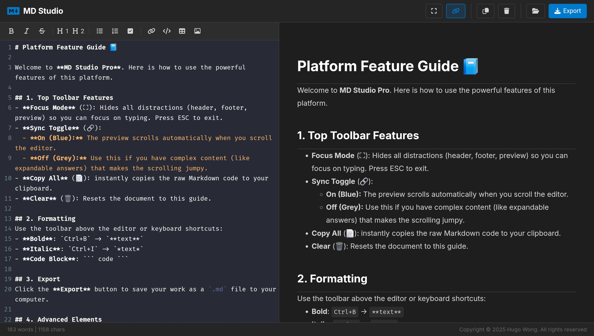

# MD Studio Pro 📝


**MD Studio Pro** is a lightweight, single-file Markdown editor designed for speed, focus, and privacy. It requires no installation, runs entirely in the browser, and saves your work locally.




## ✨ Key Features

*   **🔒 Privacy First:** Runs 100% offline. Your data is stored in your browser's LocalStorage and never leaves your device.
*   **⚡ Live Preview:** Real-time rendering of Markdown to HTML using `Marked.js`.
*   **🔄 Smart Sync Scroll:**
    *   **Linked Mode:** The preview pane accurately follows your scrolling in the editor.
    *   **Toggle:** Click the 🔗 icon to unlock scrolling for independent editing.
*   **💻 Professional Editor:** Built on **CodeMirror**, featuring line numbers, syntax highlighting, and code folding.
*   **⛶ Focus Mode:** Distraction-free writing by hiding the header, footer, and preview pane.
*   **🎨 Syntax Highlighting:** Auto-detects code blocks (JavaScript, Python, etc.) and highlights them using `Highlight.js`.
*   **📥 Import & Export:** Open existing `.md` files or export your work instantly.
*   **📱 Mobile Responsive:** Adaptive layout that switches between Editor and Preview tabs on smaller screens.

## 🚀 Getting Started

Since MD Studio Pro is a **single-file application**, there is no build process or server installation required.

### Usage
1.  Download the `index.html` file.
2.  Open it in any modern web browser (Chrome, Edge, Firefox, Safari).
3.  Start typing!

### Hosting (Optional)
You can deploy this immediately to GitHub Pages, Netlify, or Vercel by simply uploading the `index.html` file.

## 🛠️ Tech Stack

*   **Core:** HTML5, CSS3 (Flexbox/Grid), Vanilla JavaScript.
*   **Editor Engine:** [CodeMirror 5](https://codemirror.net/5/)
*   **Markdown Parser:** [Marked.js](https://marked.js.org/)
*   **Sanitizer:** [DOMPurify](https://github.com/cure53/DOMPurify) (Prevents XSS attacks).
*   **Code Highlighter:** [Highlight.js](https://highlightjs.org/).
*   **Icons:** [FontAwesome 6](https://fontawesome.com/).
*   **Fonts:** Inter (UI) and Fira Code (Editor).

## ⌨️ Keyboard Shortcuts

| Shortcut | Action |
| :--- | :--- |
| `Ctrl` + `B` | **Bold** text |
| `Ctrl` + `I` | *Italic* text |
| `Esc` | Exit Focus Mode / Close Modals |

## 🧩 Advanced Features

### Copy All
Click the clipboard icon in the toolbar to instantly copy the raw Markdown source code.

### HTML Support
MD Studio Pro supports raw HTML rendering. This is perfect for creating expandable sections:

```html
<details>
  <summary>Click to reveal answer</summary>
  This is the hidden content!
</details>
```

### Table Support
Tables are automatically styled with visible borders for better readability.

## 🤝 Contributing

Contributions are welcome! Since this is a single-file project, please ensure any Pull Requests keep the logic contained within `index.html` to maintain portability.

1.  Fork the Project
2.  Create your Feature Branch (`git checkout -b feature/AmazingFeature`)
3.  Commit your Changes (`git commit -m 'Add some AmazingFeature'`)
4.  Push to the Branch (`git push origin feature/AmazingFeature`)
5.  Open a Pull Request

## 📄 License

Distributed under the **GNU General Public License v3.0**. See `LICENSE` for more information.

---

**Copyright © 2025 Hugo Wong.**
